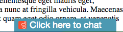
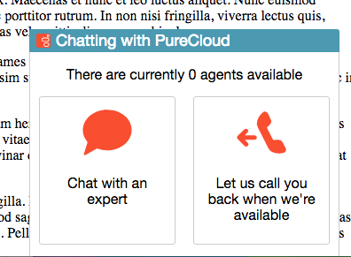
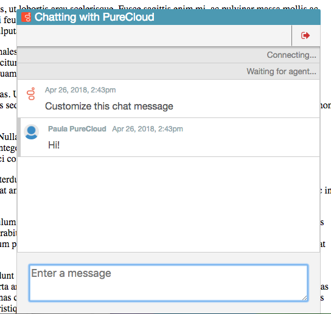
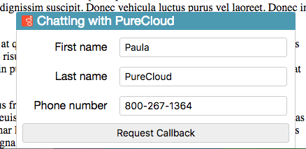

# Public Stats Service and chat widget example

A node.js service that encapsulates PureCloud API calls to provide statistics to unauthenticated external applications, as well as a script that inject a chat widget into any web page with one line of HTML.


# Chat Widget

This repo contains some example code to illustrate how a chat widget can be injected into any web page using JavaScript. This is done using a single script tag to lazy-load any missing JavaScript dependencies (PureCloud web chat library, jQuery) and inject the necessary HTML and JavaScript to run the chat widget. The chat widget also serves as an example of how to consume the service in this repo.

The injected widget is anchored to the bottom right corner of the page and is collapsed by default. When the user clicks on the title, it opens to offer the user a chat or callback. Depending on the user's selection, it will either initiate a web chat with PureCloud or collect information from the user and create a callback.


## Screenshots

Widget collapsed



Widget opened



Active web chat



Create callback form




## Configuration

Any web page that will display the chat widget must first provide the `pureCloudCustomChatConfig` and `pureCloudChatConfig` configuration objects. 


**pureCloudChatConfig**

This is the standard web chat configuration object. See the [Web Chat documentation](https://developer.mypurecloud.com/api/webchat/) for full details.

**pureCloudCustomChatConfig**

This is a custom object used to configure the widget. The following properties are supported:

* **scriptHost** (string) The path to the chat widget files. If using this project as-is, use the value `'/'`. This value must end with a forward slash.
* **queueId** (string) The ID of the queue to use when creating callbacks and subscribing to queue stats.
* **statsWebsocketUri** (string) The stats service websocket URI. This is the base URL to the stats service (e.g. `ws://localhost:8080` when running locally)
* **containerEl** (string, optional, default: `purecloud-chatwidget-chat-container`) The id to use for the chat widget element in the injected HTML. This element must not already exist in the page.
* **autoConnect** (boolean, optional, default: `false`) If `true`, automatically connects the chat on page load
* **chatWidget**
	* **width** (int, optional, default: 450) The width of the widget when a chat is connected
	* **height** (int, optional, default: 500) The height of the widget when a chat is connected
	* **backgroundColor** (string, optional, default: `#4498B4`) A valid CSS color for the header background
	* **color** (string, optional, default: `#4498B4`) A valid CSS color for the header text
* **expandAnimationMs** (int, optional, default: 800) The duration of the expand animation
* **header**
	* **defaultText** (string, optional, default: `Click here to chat`)
	* **activeText** (string, optional, default: `Chatting with PureCloud`)
	* **previewText** (string, optional, default: `Choose a channel`)
	* **logo** (string, optional, default: `https://www.genesys.com/favicon/2017/favicon.ico`)

Example config:

```
const pureCloudCustomChatConfig = {
	scriptHost: '/',
	queueId: '00000000-0000-0000-0000-000000000000',
	statsWebsocketUri: 'ws://localhost:8080',
	autoConnect: false,
	containerEl: 'purecloud-chatwidget-chat-container',
	chatWidget: {
		width: 450,
		height: 500,
		backgroundColor: '#4498B4',
		color: '#F6F6F6'
	},
	expandAnimationMs: 800,
	header: {
		defaultText: 'Click here to chat',
		activeText: 'Chatting with PureCloud',
		previewText: 'Choose a channel',
		logo: '/img/logo-genesys.svg'
	}
}
```


## Usage

To add the web chat widget to your page, simply include the `chat-injector.js` script. This script tag may be loaded in the `<head>` or `<body>` elements, though the configuration variables must be defined prior to this script tag. If your site uses jQuery or already references the PureCloud web chat library (jsapi-v1.js), be sure to include those script tags before the chat injector to prevent double loading those libraries.

In the context of this example project, this would be:

```
<script src="/scripts/chat-injector.js" type="text/javascript"></script>
```


## Example

See the file `static/index.html` in this repo for example configuration and usage. This file is served as the default page from the service in this repo. By default, the URL to this page will be `http://localhost:8080/`.


# Stats Service

The stats service uses Client Credentials to connect to PureCloud to retrieve queue observations, EWT, and subscribe to queue observation notifications. The service exposes a REST API to retrieve that data, as well as an endpoint to create a callback. The purpose of this service is to illustrate how to expose PureCloud statistics and callback creation without exposing PureCloud credentials or other APIs. This service uses the [JavaScript SDK for node.js](https://www.npmjs.com/package/purecloud-platform-client-v2) to access the PureCloud API.


## Prerequisites

* Node.js (developed using v8)
* A PureCloud org's [client credentials](https://developer.mypurecloud.com/api/rest/authorization/create-oauth-client-id.html)


## Installation

1. Clone this repo
2. Run `npm i`


## Configuration

* Set the following environment variables:
	* **PURECLOUD_CLIENT_ID** The client credentials' client ID
	* **PURECLOUD_CLIENT_SECRET** The client credentials' client secret
	* **PURECLOUD_MONITORED_QUEUES** A comma-separated list of queues to use to subscribe to `v2.analytics.queues.{queueId}.observations` (no spaces!)
	* **PORT** (_optional_, default: 8080) The port on which the service will bind
	* **CACHE_SECONDS** (_optional_, default: 2) The number of seconds to hold responses in cache before they expire; caching prevents additional PureCloud API requests for the same data.


## Usage

**GET /api/stats/{queueId}**

_Get stats for a given queue ID_

* Path params:
	* **queueId** The ID of the queue for which to fetch stats
* Query Params:
	* **key** (string[]) The type of stats to get. Values: ewt, observations
	* **mediaType** (string, _optional_) When used with key=ewt, returns the EWT for the given media type. If not specififed, EWT is for the entire queue.
* Example response: 

```
{
  "observations": {
    "availableAgents": 0,
    "busyAgents": 0,
    "voice": {
      "interacting": 0,
      "waiting": 0
    },
    "screenshare": {
      "interacting": 0,
      "waiting": 0
    },
    "chat": {
      "interacting": 0,
      "waiting": 1
    },
    "callback": {
      "interacting": 0,
      "waiting": 0
    },
    "cobrowse": {
      "interacting": 0,
      "waiting": 0
    },
    "video": {
      "interacting": 0,
      "waiting": 0
    },
    "message": {
      "interacting": 0,
      "waiting": 0
    },
    "email": {
      "interacting": 0,
      "waiting": 0
    }
  },
  "ewt": 8
}
```

**POST /api/callback**

_Creates a callback_

* Request body: Supports the same structure as `POST /api/v2/conversations/callbacks`. See [https://developer.mypurecloud.com/api/rest/v2/conversations/index.html#postConversationsCallbacks](https://developer.mypurecloud.com/api/rest/v2/conversations/index.html#postConversationsCallbacks)
* Response: 204, no content


# Additional Information

* For questions or issues, post on the [PureCloud Developer Forum](https://developer.mypurecloud.com/forum/c/purecloud-integrations)
* PRs accepted! Open an issue in this repo first to discuss proposed changes prior to submitting a PR.
* License: MIT (see LICENSE in this repo)
